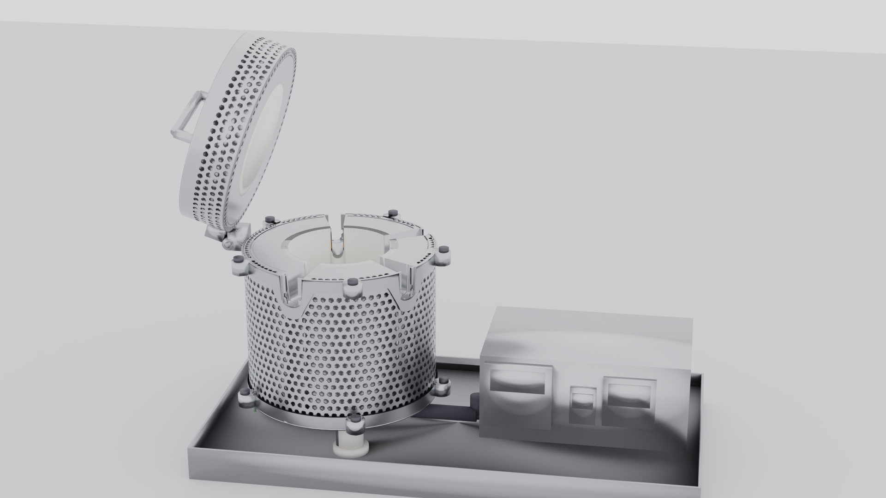
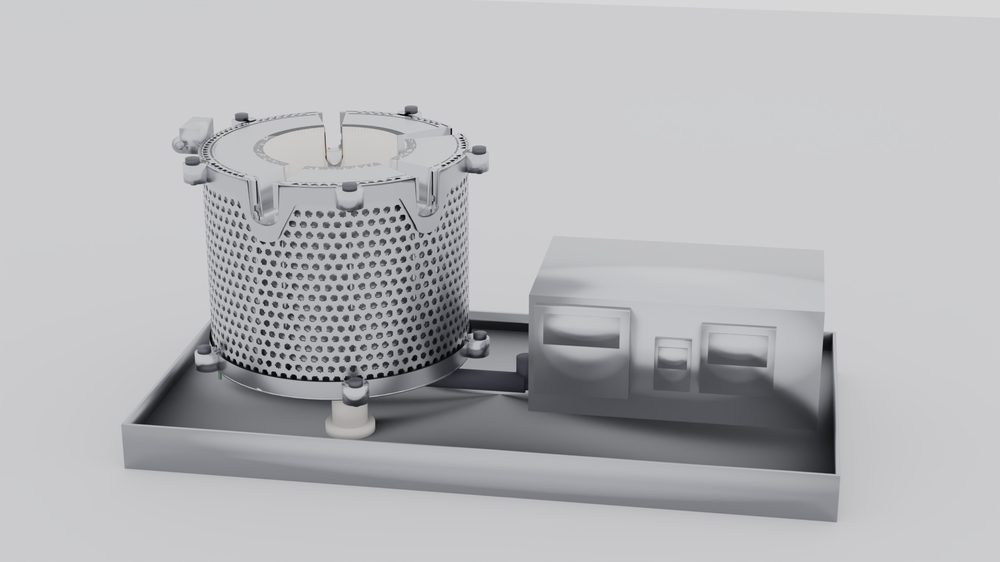

# Nice Dreamz Heat & Clean Glass Oven

**The perfect heat, every time. Drop in your terp slurper, banger, or ball vape -- the oven heats the entire barrel evenly to your exact target temperature. When you're done, crank it up and burn off all the char and resin too.**



Heat & Clean is a precision ceramic oven that heats your glass pieces to the perfect dabbing or vaping temperature -- no torch, no guessing, no hot spots. Set your temp, drop in your piece, and get a perfect session every time. And when your glass gets gunked up? Same oven, higher temp, walk away. Comes back looking brand new.

---

## The Problem

Torches and coil heaters can't evenly heat modern glass pieces.

| | |
|---|---|
|  |  |

**With a torch**, only the bottom dish and a small portion of the barrel gets heated. You're guessing at temperature every single time -- too hot and you scorch it, too cool and you waste product.

**With a coil heater**, even a 10-wrap coil only covers half the barrel. The top half never reaches temp. Uneven heat means uneven flavor.

---

## The Solution

The Heat & Clean oven surrounds the **entire piece** in even, controlled heat.

| | |
|---|---|
|  |  |

The 91mm tall ceramic chamber heats the **whole barrel** -- top to bottom, all the way around. Tower-style terp slurpers with 80mm barrels fit completely inside. Set your exact target temperature and hit it every time. Lower temps, better flavor, zero waste.

---

## Two Modes, One Device

### Heating Mode
Drop in your terp slurper, banger, or ball vape heater. Set your preferred dabbing or vaping temperature -- most sessions run in the 500-600 F sweet spot. The PID controller brings it to temp and holds it perfectly. Pull it out, attach it, and enjoy a perfect session every time.

### Cleaning Mode
Crank the temperature up. Walk away. The oven burns off all char, resin, and buildup. Come back to glass that looks brand new. No chemicals, no scrubbing, no soaking. The 6-hour auto-shutoff timer means you can set it and forget it.

---

## Features

- **Precision PID temperature control** -- REX-C100 controller holds your target temp within a few degrees
- **Locked-down interface** -- just set your temp and go, no confusing menus
- **Triple safety system** -- software limit (870 F) + overheat alarm (900 F) + thermal fuse (930 F)
- **6-hour auto-shutoff** -- DH48S timer relay cuts power automatically
- **Insulated dual-wall construction** -- 31mm ceramic-to-outer-wall gap keeps exterior cool to the touch
- **Perforated mesh exterior** -- full airflow ventilation with clean stainless steel look
- **Ceramic feet** -- heat-insulating legs keep the steel tray cool
- **Hinged lid** -- opens to 95 degrees for easy loading, ceramic disk seals the chamber
- **Ceramic retaining ridge** -- top cap holds the ceramic cylinder in place from above with a 5mm ridge between element slots

---

## What's Inside



| Component | Material |
|-----------|----------|
| Heating chamber | High-alumina ceramic cylinder (90mm OD) |
| Heating element | Kanthal wire coil (30 wraps) |
| Inner housing | 1.2mm 304 stainless steel |
| Outer mesh | 1.2mm perforated 304 stainless steel |
| Insulation gap | 24.6mm air gap between ceramic and housing |
| Controller | REX-C100 PID + SSR + DH48S timer |
| Legs | 3x ceramic feet with M6 mounting |

---

## Specifications

| Spec | Value |
|------|-------|
| Chamber ID | 81.5 mm (3.2 in) |
| Chamber height | 91 mm (3.6 in) |
| Outer diameter | 154.5 mm (6.1 in) |
| Temperature range | 100 - 870 F |
| Power | 120V AC |
| Auto-shutoff | 6 hours |
| Wall thickness | 31 mm (ceramic to outer mesh) |
| Body material | 304 stainless steel, brushed finish |

---

## Works With

- Tower-style terp slurpers (up to 80mm barrel)
- Standard bangers
- Ball vape heaters
- Any glass piece that fits the 81.5mm chamber

---

## License

All rights reserved. Nice Dreamz 2025.

---

## Project Structure

```
Scripts/
  assembly_config.py          -- shared dimensions, colors, rotation config
  export_all_parts.py         -- generates all part geometry (STL/OBJ/GLB)
  generate_flat_patterns.py   -- laser-cut flat patterns (DXF/SVG)
  render_blender.py           -- photorealistic Blender rendering
  view_lid_open.py            -- full assembly, lid open 95 degrees
  view_lid_off.py             -- full assembly, lid closed
  view_4_metal_parts.py       -- 4 main metal parts side by side
  view_topcap_ceramic.py      -- top cap on ceramic cylinder (fit check)
  view_caps_ceramic.py        -- both caps + ceramic cylinder
  view_bottom_assembly.py     -- bottom cap + tray + feet + leg bolts
  view_seethrough_assembly.py -- full assembly, all parts transparent

CAD Exports/
  Individual Parts/STL/       -- individual part STL files
  Individual Parts/OBJ/       -- individual part OBJ files
  Individual Parts/GLB/       -- individual part GLB files
  Flat Patterns/DXF/          -- laser-cut DXF patterns
  Flat Patterns/SVG/          -- laser-cut SVG patterns
  *.glb                       -- assembly view exports
```
